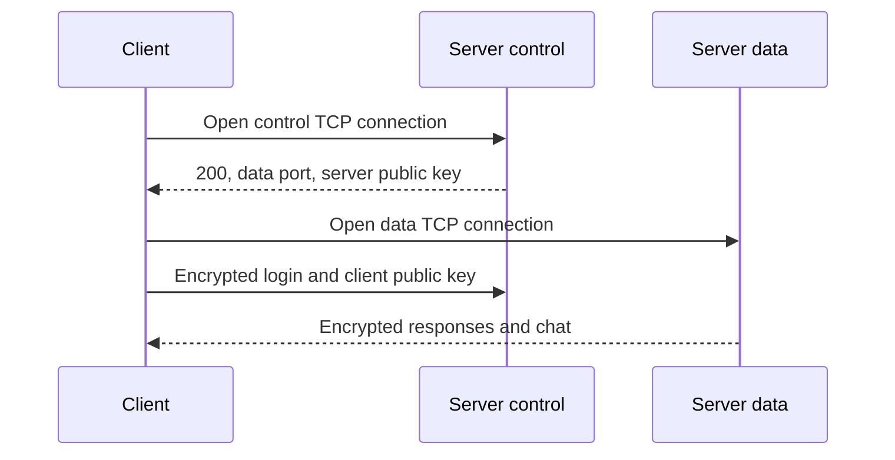

# CNT4713 Project 3 - Complete Step-by-Step Guide

This guide takes the project from a Windows computer with no setup through
local testing, GitHub collaboration, Wireshark capture, video recording, and
Canvas submission. If a program is already installed, run its verification
command and skip its installation subsection.

## 1. What the project does

The application is a multi-client TCP chat system with two Python processes:

- `server.py` listens for clients and routes messages.
- `client.py` accepts the six required commands: `connect`, `login`, `who`,
  `broadcast`, `private`, and `quit`.

Each client uses two TCP connections:

- The CONTROL connection carries commands from client to server.
- The DATA connection carries responses and chat messages from server to
  client.

The server and every client create a new 2048-bit RSA key pair in memory each
time they start. The connect response sends the server public key. The login
request sends the client's public key. After the key exchange, messages use
RSA-OAEP with SHA-256.



## 2. Know which files are which

The project folder contains:

| File | Purpose | Canvas submission |
| --- | --- | --- |
| `server.py` | Required server program | Yes |
| `client.py` | Required client program | Yes |
| `answers.txt` | Required security questions | Yes |
| `requirements.txt` | Installs `cryptography` | Usually no |
| `README.md` | Short team and run instructions | Only if requested |
| `PROJECT_GUIDE.md` | This development/demo guide | No |
| `.gitignore` | Keeps temporary files out of Git | No |
| `tests/integration_test.py` | Automated two-client verification | No |

Do not rename `server.py` or `client.py`. The assignment says the autograder
looks for those exact names.

## 3. Install or verify the required software

### 3.1 Python

1. Open <https://www.python.org/downloads/windows/>.
2. Install a current 64-bit Python 3 release.
3. If the installer offers an option to add Python to `PATH`, enable it.
4. Close and reopen Windows Terminal or PowerShell after installation.
5. Run:

```powershell
py --version
```

The output must begin with `Python 3.`. This project is written for Python
3.10 or newer.

### 3.2 Visual Studio Code

1. Open <https://code.visualstudio.com/download>.
2. Download the Windows User Installer for x64 unless the computer is ARM.
3. Run the installer with the normal defaults.
4. Open VS Code.
5. Click the Extensions icon on the left.
6. Search for `Python`.
7. Install the extension published by Microsoft.

The direct extension page is
<https://marketplace.visualstudio.com/items?itemName=ms-python.python>.

### 3.3 Git

1. Open <https://git-scm.com/install/windows>.
2. Download and run Git for Windows.
3. The normal installer defaults are suitable.
4. Close and reopen PowerShell.
5. Run:

```powershell
git --version
```

### 3.4 Wireshark and Npcap

1. Open <https://www.wireshark.org/download.html>.
2. Download the Windows x64 installer.
3. During installation, allow Wireshark to install Npcap.
4. Keep Npcap loopback capture support enabled. It is required to capture
   traffic when both programs use `127.0.0.1`.
5. Finish the installation and restart Windows if the installer requests it.

### 3.5 Optional screen recorder

Windows Snipping Tool can record a selected screen area. OBS Studio is more
reliable when several terminals and Wireshark must remain visible:
<https://obsproject.com/download>.

## 4. Put the project on the computer

Create one clean folder. A good location is:

```text
C:\Users\<YOUR-WINDOWS-USERNAME>\Documents\CNT4713-Project-3
```

Place all supplied project files directly inside that folder. Do not place the
Python files inside another nested folder.

Open the folder in VS Code:

1. Open VS Code.
2. Select **File > Open Folder**.
3. Choose `CNT4713-Project-3`.
4. If VS Code asks whether you trust the authors, choose **Yes, I trust the
   authors** because these are your team's files.
5. Select **Terminal > New Terminal**.

The terminal prompt should end with the project folder name. Verify the files:

```powershell
Get-ChildItem
```

You should see `server.py`, `client.py`, and `answers.txt`.

## 5. Create an isolated Python environment

A virtual environment prevents this class project from changing packages used
by unrelated Python projects.

In the VS Code PowerShell terminal, run:

```powershell
py -m venv .venv
```

Activate it:

```powershell
.\.venv\Scripts\Activate.ps1
```

If PowerShell says script execution is disabled, run this temporary,
process-only setting and try activation again:

```powershell
Set-ExecutionPolicy -Scope Process -ExecutionPolicy Bypass
.\.venv\Scripts\Activate.ps1
```

The terminal prompt should now start with `(.venv)`.

Install the required library:

```powershell
python -m pip install --upgrade pip
python -m pip install -r requirements.txt
```

Verify it:

```powershell
python -c "import cryptography; print(cryptography.__version__)"
```

Any version that satisfies `requirements.txt` is acceptable.

## 6. Understand the protocol before running it

### 6.1 The initial connect exchange

The user's command:

```text
connect 127.0.0.1 8991
```

is handled locally by `client.py`. It opens the CONTROL TCP connection to the
server. The server replies in plaintext:

```text
200

<DATA PORT>
-----BEGIN PUBLIC KEY-----
<SERVER PUBLIC KEY DATA>
-----END PUBLIC KEY-----
```

This first response cannot be encrypted with a client-specific key because the
server does not have the client's public key yet.

### 6.2 The login exchange

The client serializes its public key in PEM form and builds this logical
message:

```text
login

<USERNAME>
-----BEGIN PUBLIC KEY-----
<CLIENT PUBLIC KEY DATA>
-----END PUBLIC KEY-----
```

The entire logical message is encrypted with the server's public key and sent
on the CONTROL connection. The server decrypts it, rejects duplicate
usernames, saves the client's public key, and replies on the DATA connection.

### 6.3 Why RSA chunking is necessary

A 2048-bit RSA ciphertext block is 256 bytes. OAEP with SHA-256 can encrypt at
most 190 plaintext bytes per block:

```text
256 - (2 x 32) - 2 = 190 bytes
```

A PEM public key is much larger than 190 bytes. Therefore, the login message
cannot be passed to one RSA `encrypt()` call. The implementation splits the
logical message into blocks of at most 190 bytes, encrypts each block, and
joins the 256-byte ciphertext blocks. Decryption reverses the process.

### 6.4 Why TCP framing is necessary

TCP is a byte stream. One `sendall()` call is not guaranteed to equal one
`recv()` call. Two messages can arrive together, or one message can arrive in
pieces.

Every encrypted logical message therefore has:

```text
4-byte unsigned network-order ciphertext length
<that many ciphertext bytes>
```

The receiver first reads exactly four bytes, obtains the length, and then
keeps reading until the complete ciphertext arrives.

### 6.5 SHA-256 and RSA-OAEP

Each logical plaintext is placed in an envelope containing:

```text
CNT4713-SHA256
<64-character SHA-256 hexadecimal digest>
<original logical message>
```

The complete envelope is encrypted. After RSA decryption, the recipient
recomputes SHA-256 and rejects the envelope if the digest differs.

RSA-OAEP also uses SHA-256 for its mask-generation and padding operations.
OAEP is probabilistic, so encrypting the same message twice produces different
ciphertext.

### 6.6 Concurrency

The server starts one thread for each CONTROL connection. All active users are
stored in a shared dictionary protected by a lock. Each client also has a
send lock. That second lock prevents two server threads from writing
overlapping frames to the same DATA socket.

The client has:

- a main thread that reads typed commands and sends them; and
- a listener thread that continuously receives broadcasts, private messages,
  join notifications, quit notifications, and command responses.

## 7. Run the complete normal test

Use three terminals: one server, Bob's client, and Alice's client.

### 7.1 Start the server

In VS Code, select **Terminal > New Terminal** and run:

```powershell
python server.py 8991
```

Expected startup:

```text
Starting server...
Creating RSA keypair
RSA keypair created
Creating server socket
Awaiting connections...
```

Leave this terminal running.

If Windows Firewall appears, allow Python on **Private networks**. Public
network access is not needed for the local demonstration.

### 7.2 Start Bob

Create a second terminal with the plus button in the Terminal panel. Run:

```powershell
python client.py
```

At the prompt, enter these one at a time:

```text
connect 127.0.0.1 8991
login bob
```

The client prints the dynamic DATA port after `connect` and a successful login
status after `login`.

### 7.3 Start Alice

Create a third terminal and run:

```powershell
python client.py
```

Enter:

```text
connect 127.0.0.1 8991
login alice
```

Bob should receive an encrypted join notification for Alice.

### 7.4 Exercise every graded command

In Alice's terminal, enter:

```text
who
```

Alice should see Bob in the connected-user list.

Then enter:

```text
broadcast Hello all!
```

Both Alice and Bob should display:

```text
Broadcast message from alice: Hello all!
```

Then enter:

```text
private bob Let's talk
```

Alice should see `Message sent.` Bob should see:

```text
alice: Let's talk
```

In Alice's terminal:

```text
quit
```

Bob should receive Alice's logout notification.

Finally, in Bob's terminal:

```text
quit
```

Stop the server with `Ctrl+C`.

## 8. Run failure tests before recording

These tests are not all shown in the output template, but they demonstrate that
the required `500` behavior works.

### 8.1 Duplicate username

1. Start the server and one client.
2. Log the first client in as `bob`.
3. Start another client and connect it.
4. Try `login bob`.
5. Confirm the second client receives status `500`.
6. In the same second client, try `login alice`.
7. Confirm that login now succeeds.

### 8.2 Missing private-message recipient

After Alice logs in, enter:

```text
private nobody Test message
```

Alice should receive status `500`.

### 8.3 Invalid command shape

Try each of these:

```text
broadcast
private bob
connect 127.0.0.1 not-a-port
```

The client should print a usage message and should not crash.

### 8.4 Different control port

The port is variable. Stop everything and repeat with:

```powershell
python server.py 9105
```

Clients must then use:

```text
connect 127.0.0.1 9105
```

This confirms that the program does not hard-code port 8991.

### 8.5 Run the automated verification

From the project root:

```powershell
python tests/integration_test.py
```

The script starts the real `server.py` plus two real `client.py` processes. It
checks connect, duplicate login rejection, successful login retry, `who`,
broadcast, failed and successful private messages, logout notification, and
both quit responses. Success ends with:

```text
PASS: encrypted two-client integration test
```

## 9. Capture the project in Wireshark

### 9.1 Start the correct capture

1. Close old server and client processes.
2. Open Wireshark as a normal user.
3. Find **Adapter for loopback traffic capture** or **Npcap Loopback
   Adapter**.
4. Double-click that adapter.
5. Start the server and clients using `127.0.0.1`.

If the loopback adapter is missing, rerun the Wireshark installer, make sure
Npcap is installed, and restart Windows.

### 9.2 Apply a display filter

Start with the control port:

```wireshark
tcp.port == 8991
```

Each client prints its DATA port after connecting. Suppose Bob receives 52110
and Alice receives 52111. Expand the filter:

```wireshark
tcp.port == 8991 || tcp.port == 52110 || tcp.port == 52111
```

Replace those example DATA ports with the actual values shown by the clients.

### 9.3 Show the plaintext handshake

1. Select a packet on port 8991 near the start of a connection.
2. Right-click it.
3. Choose **Follow > TCP Stream**.
4. Locate the server-to-client connect response.
5. Highlight or point out:
   - status `200`;
   - the empty line;
   - the dynamic DATA port; and
   - `BEGIN PUBLIC KEY` through `END PUBLIC KEY`.

This is the required bootstrap key exchange.

### 9.4 Show that later commands are encrypted

After login, the same CONTROL stream contains:

- four bytes representing the ciphertext length; and
- one or more 256-byte RSA ciphertext blocks.

The words `login`, `who`, `broadcast`, `private`, the usernames, and the chat
text should not be visible as plaintext.

Use **Follow TCP Stream** on a DATA-port packet as well. Explain that responses
are on the DATA socket and are also encrypted separately with that client's
public key.

Do not claim that Wireshark decrypted the application messages. The point of
this demonstration is that Wireshark can see the TCP traffic and framing but
cannot read the protected application plaintext.

## 10. Record the video in rubric order

Arrange these windows so all are readable:

- server terminal;
- Bob client terminal;
- Alice client terminal; and
- Wireshark.

A good narration sequence is:

1. State the course, project, and four team-member names.
2. Show `server.py` starting with a variable control port.
3. Explain that the server creates a new RSA-2048 key pair in memory.
4. Connect Bob; point out the dynamic DATA port and server public-key
   exchange.
5. Log Bob in; explain that the username and client public key were encrypted.
6. Connect and log in Alice; show Bob's join notification.
7. Run `who` as Alice and show Bob in the result.
8. Run `broadcast Hello all!` and show the message in both clients.
9. Run `private bob Let's talk` and show that only Bob receives the content
   while Alice receives the send confirmation.
10. Run `quit` for Alice and show Bob's logout notification.
11. Run `quit` for Bob and show graceful closure.
12. Switch to Wireshark.
13. Highlight the plaintext connect response format.
14. Highlight the CONTROL and DATA TCP streams after login and explain that
    the visible bytes are length-framed RSA ciphertext.
15. Briefly mention the security limitations discussed in `answers.txt`.

Keep the narration factual. Do not say the protocol is equivalent to TLS; the
answers explain why it is not.

## 11. Create the private GitHub repository

No Project 3 repository currently exists under `wild1leon` or the prior
`jm19pa/Net-Centric-Computing-Project-1` naming pattern.

Keep the new repository private until the class and academic-integrity window
are over.

### 11.1 Create it on GitHub

1. Sign in to <https://github.com/> as `wild1leon`.
2. Open <https://github.com/new>.
3. Set **Owner** to `wild1leon`.
4. Set **Repository name** to:

```text
Net-Centric-Computing-Project-3
```

5. Description:

```text
CNT4713 encrypted multi-client chat project
```

6. Select **Private**.
7. Do not add a GitHub README, `.gitignore`, or license. The local folder
   already has the first two.
8. Click **Create repository**.

### 11.2 Initialize and push from VS Code

In the project terminal:

```powershell
git init -b main
git status
git add server.py client.py answers.txt requirements.txt README.md PROJECT_GUIDE.md .gitignore tests
git status
git commit -m "Implement encrypted chat project"
git remote add origin https://github.com/wild1leon/Net-Centric-Computing-Project-3.git
git push -u origin main
```

The first push may open a browser sign-in or Git Credential Manager window.
Sign in to `wild1leon` and authorize Git.

Refresh the repository page and confirm that the files are visible.

### 11.3 Invite the team

1. In the private repository, open **Settings**.
2. Select **Collaborators** or **Collaborators and teams**.
3. Click **Add people**.
4. Add Juan using the confirmed GitHub username `jm19pa`.
5. Ask Michael Estrada and Bishal Ghosh for their exact GitHub usernames.
6. Add those exact accounts. Do not guess based on their names.

### 11.4 Safe teammate workflow

Each teammate can clone:

```powershell
git clone https://github.com/wild1leon/Net-Centric-Computing-Project-3.git
cd Net-Centric-Computing-Project-3
```

For a review or change, use a separate branch:

```powershell
git switch -c review-michael
```

After editing:

```powershell
git add .
git commit -m "Review client behavior"
git push -u origin review-michael
```

Then open a pull request on GitHub. This avoids four people overwriting
`main`.

Recommended review ownership, not claimed authorship:

- Michael: run and review all client commands and exact client output.
- Bishal: review the cryptography logic and all four written answers.
- Juan: run and review server concurrency, ports, and GitHub/video setup.
- Alejandro: integrate feedback, rerun the complete test, and prepare the
  final submission.

Every person should understand the final code before the team records or
submits it.

## 12. Canvas and video submission checklist

Use the current Canvas fields because the instructor says LMS instructions
override the PDF if they differ.

### Code and answers

- Upload `server.py`.
- Upload `client.py`.
- Upload `answers.txt`.
- Do not upload a ZIP.
- Do not upload IDE project files.
- Do not replace the source files with a Google Drive or GitHub link.
- Open the uploaded files from Canvas once to confirm they are the final
  versions.

### Video

- Upload to YouTube as **Unlisted**, or upload to Google Drive.
- For Google Drive, set General access to **Anyone with the link - Viewer**.
- Open an Incognito/InPrivate browser window where you are not signed in.
- Paste the video link and verify that it plays.
- Submit the link before the deadline.
- Keep the link working for the rest of the semester.

## 13. Important autograder ambiguity to ask about

The PDF says a known client will test the submitted server and a known server
will test the submitted client. However, it does not specify all wire-level
choices needed for two independently written implementations to interoperate:

- RSA padding and its hash parameters;
- PEM versus DER public-key serialization;
- ciphertext encoding, such as raw bytes, hexadecimal, or Base64;
- ciphertext framing over TCP;
- how a PEM-bearing login larger than one RSA block is encrypted; or
- whether the stated SHA-256 hash is transmitted, signed, or included with
  the encrypted plaintext.

Send this concise question to the instructor if no starter code or protocol
addendum exists:

> Professor, because Project 3 will cross-test our client and server with
> prewritten counterparts, could you confirm the required wire format for
> encrypted messages: RSA padding/hash settings, PEM or DER public keys,
> ciphertext encoding/framing, and how the login plus public key should be
> handled when it exceeds one RSA block? The PDF specifies RSA-2048 and
> SHA-256 but not those interoperability details.

If the instructor supplies an answer, update both `server.py` and `client.py`
to that exact convention before submission.

## 14. Troubleshooting

### `No module named cryptography`

Activate the environment and reinstall:

```powershell
.\.venv\Scripts\Activate.ps1
python -m pip install -r requirements.txt
```

### `python` or `py` is not recognized

Close and reopen the terminal. If it still fails, install Python from the
official Windows page and enable its PATH option.

### `Address already in use` or Windows error 10048

Another process owns the port. Stop old server windows or choose another port:

```powershell
python server.py 9105
```

Use the same new port in every client's `connect` command.

### `Connection refused` or Windows error 10061

Confirm:

- the server is still running;
- the client uses the same port;
- the IP is `127.0.0.1` for same-computer testing; and
- Windows Firewall allowed Python on the private network.

### Clients on different computers cannot connect

On the server computer, run:

```powershell
ipconfig
```

Use that computer's active Wi-Fi or Ethernet IPv4 address instead of
`127.0.0.1`. Both computers must be reachable on the same network, and the
server computer's firewall must permit the selected control port.

Do not use a public cafe or campus network for the first test; client isolation
may block direct device-to-device traffic.

### Wireshark shows no local packets

Capture on the Npcap loopback adapter, not Wi-Fi or Ethernet, when the clients
use `127.0.0.1`.

### Terminal prompts look duplicated

An asynchronous incoming message can arrive while `input()` is displaying
`> `. The listener redraws the prompt, so an occasional extra prompt is only a
console-display artifact. It does not duplicate a network command.

### A long message works locally but another implementation rejects it

That is likely the unspecified RSA/framing convention described in Section
13. Confirm the instructor's hidden-client protocol before changing the
cryptography at random.
